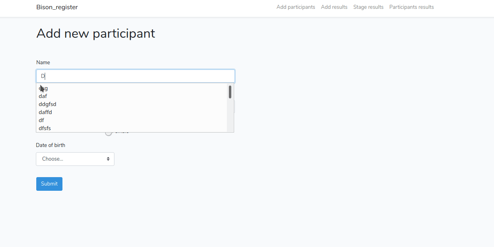

<hi>App for registering running competition results "Bison register"</h1>

    ### Installation

    git clone https://github.com/vanhell86/Bison-register.git
    cd projectname
    composer install
    npm install
    php artisan key:generate
    create new database and edit .env file for DB settings
    php artisan serve
    
    ### Include
    Laravel 7 (https://laravel.com/docs/7.x)
    Bootstrap (http://getbootstrap.com)
 
    ### Pages 
    There are 4 pages. which are Add participant and Add results, Stage results, Participant result. 
    
    ### Functionality example 

